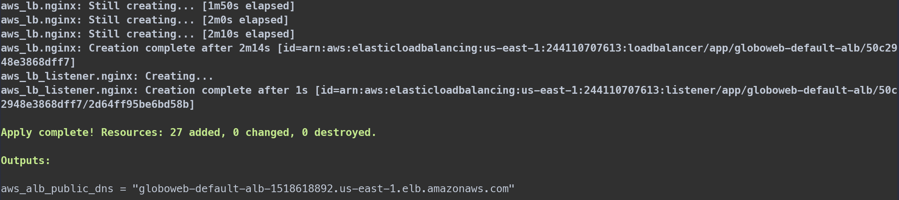
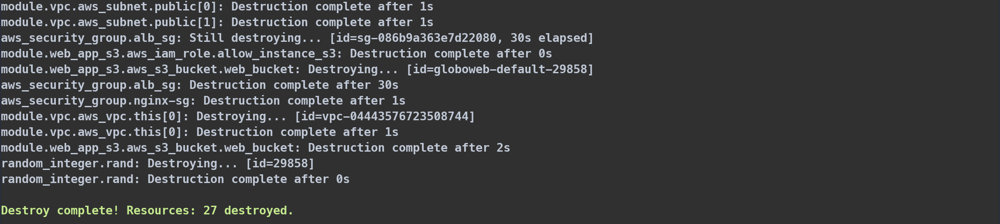

# terraform_webapp
Deploy static web application to **AWS** using **Terraform**
> Be informed that resources creation in AWS is not free, do not forget to destroy it when you're done.

## Requirements
* AWS account
* AWS CLI
* Terraform (~>1.1)
* Unix

## Prerequisites
1. Configure an AWS profile or use existing with proper credentials (**us-east-1** region, admin access is preferred
   or **full access** to **VPC**, **IAM**, **AWSNetworkManager**, **EC2**, **S3**, **RDS**,
   **AmazonSSM** and other resources):
   ```bash
   aws configure --profile profile_name
   export AWS_PROFILE=profile_name
   ```

1. Create or use **default** workspace (supported **Development**, **UAT** or **Production**):
    ```sh
    terraform workspace list
    # terraform workpace new Development && terraform select Development
    # terraform workpace new UAT && terraform select UAT
    # terraform workpace new Production && terraform select Production
    ```
1. Initialize a working directory containing **Terraform** configuration files:
    ```sh
    terraform init
    ```
2. Create an execution plan, which lets you preview the changes that **Terraform** plans to make to your infrastructure:
    ```sh
    terraform plan -out webapp_default.tfplan
    ```
3. Execute the actions proposed in a **Terraform** plan and wait until it's done:
    ```sh
    terraform apply webapp_default.tfplan
    ```
4. Check the **outputs** and follow by the web app link:
    
    
5. Destroy all remote objects managed by current workspace configuration:
    ```sh
    terraform workspace list
    terraform destroy -auto-approve
    ```
    
